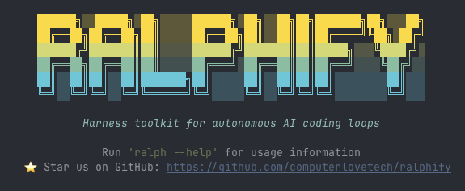

<p align="center">
  
</p>

<p align="center">
  <a href="https://pypi.org/project/ralphify/"></a>
  <a href="https://pypi.org/project/ralphify/"></a>
  <a href="https://github.com/computerlovetech/ralphify/blob/main/LICENSE"></a>
  <a href="https://ralphify.co/docs/"></a>
</p>

**Ralphify runs ralph loops.**

A **ralph loop** is a portable directory that defines an autonomous agent loop — a prompt, the commands to run between iterations, and any files the agent needs. It's an open format ([ralphloops.io](https://ralphloops.io/)): one required file, `RALPH.md`. Ralphify is the CLI that runs it.

```
grow-coverage/
├── RALPH.md               # the loop definition (required)
└── check-coverage.sh      # a command that runs each iteration
```

```markdown
---
agent: claude -p --dangerously-skip-permissions
commands:
  - name: coverage
    run: ./check-coverage.sh
---

Each iteration, write tests for one untested module, then stop.

## Current coverage

{{ commands.coverage }}
```

```bash
ralph run grow-coverage     # loops until Ctrl+C
```

Each iteration starts with a **fresh context window** and **current data**: ralphify runs the commands, fills in the `{{ placeholders }}`, pipes the prompt to your agent, and loops. Walk away, come back to a pile of commits.

*Works with any agent CLI. Swap `claude -p` for Codex, Aider, or your own — just change the `agent` field.*

## Install

```bash
uv tool install ralphify    # recommended
pipx install ralphify       # or pipx
pip install ralphify        # or pip (use a virtualenv)
```

Any of these gives you the `ralph` command.

---

## The five things you do with ralphify

Everything in ralphify is one of these five jobs. That's the whole tool.

### 1. Write a ralph

A ralph is a *directory* containing a `RALPH.md` file — that file is the only requirement, and its shape is defined by the open [ralph loops format](https://ralphloops.io/). Scaffold one:

```bash
ralph scaffold my-ralph
```

`RALPH.md` is YAML frontmatter + a markdown prompt. The only required field is `agent`:

```markdown
---
agent: claude -p --dangerously-skip-permissions
---

Read TODO.md, pick the top unfinished task, implement it fully, commit, then stop.
One task per iteration. No placeholder code.
```

The format has three frontmatter fields — `agent`, `commands` (live data, see below), and `args` (user arguments that parameterize the loop). `args` lets one ralph be reused with different inputs:

```markdown
---
agent: claude -p --dangerously-skip-permissions
commands:
  - name: tests
    run: uv run pytest -x
args:
  - focus
---

Refactor the code under {{ args.focus }}. Keep tests green.

{{ commands.tests }}
```

```bash
ralph run my-ralph --focus src/auth     # {{ args.focus }} → src/auth
```

### 2. Feed it live data

`commands` run before each iteration. Their output replaces `{{ commands.<name> }}` in the prompt, so the agent always sees the current state — test results, coverage, git log, lint output:

```markdown
---
agent: claude -p --dangerously-skip-permissions
commands:
  - name: tests
    run: uv run pytest -x
---

## Test results

{{ commands.tests }}

If tests are failing, fix them before starting new work.
```

When the agent breaks a test, the next iteration sees the failure and fixes it. That's the self-healing feedback loop.

### 3. Run the loop

```bash
ralph run my-ralph           # loops until Ctrl+C
ralph run my-ralph -n 5      # run 5 iterations then stop
```

Each iteration: run commands → assemble the prompt → pipe it to the agent → repeat with fresh context.

### 4. Steer it while it runs

The prompt body is re-read from disk every iteration. Edit `RALPH.md` while the loop runs and the agent follows your new rules on the next cycle. When it does something dumb, add a sign:

```markdown
## Rules

- Do NOT delete failing tests — fix the underlying code instead.
```

### 5. Share and install ralphs

A ralph is just a directory in the [ralph loops format](https://ralphloops.io/), so it's portable — version it in git, share it, install it. Use [agr](https://github.com/computerlovetech/agr) to install one from GitHub:

```bash
agr add owner/repo/grow-coverage   # install a ralph
ralph run grow-coverage            # run it by name
```

---

## Why loops

A single agent run can fix a bug or write a function. The leverage of a ralph loop is **sustained, autonomous work** — running for hours, one commit at a time, while you do something else.

- **Fresh context every iteration.** No context-window bloat. The agent starts clean and reads the current state of the codebase.
- **Commands as feedback.** Live data feeds back into the prompt each loop, so the agent self-corrects.
- **Steer with a text file.** Edit the prompt mid-run to redirect a running agent.
- **Progress lives in git.** Every iteration commits. `git log` shows what happened; `git reset` rolls it back.

Read the original writeup: [Ralph Wiggum as a "software engineer"](https://ghuntley.com/ralph/).

## Documentation

Full docs at **[ralphify.co/docs](https://ralphify.co/docs/)** — getting started, the loop lifecycle, CLI reference, and cookbook. The format spec lives at **[ralphloops.io](https://ralphloops.io/)**.

## Requirements

- Python 3.11+
- An agent CLI that accepts piped input ([Claude Code](https://docs.anthropic.com/en/docs/claude-code), Codex, Aider, or your own)

## License

MIT
